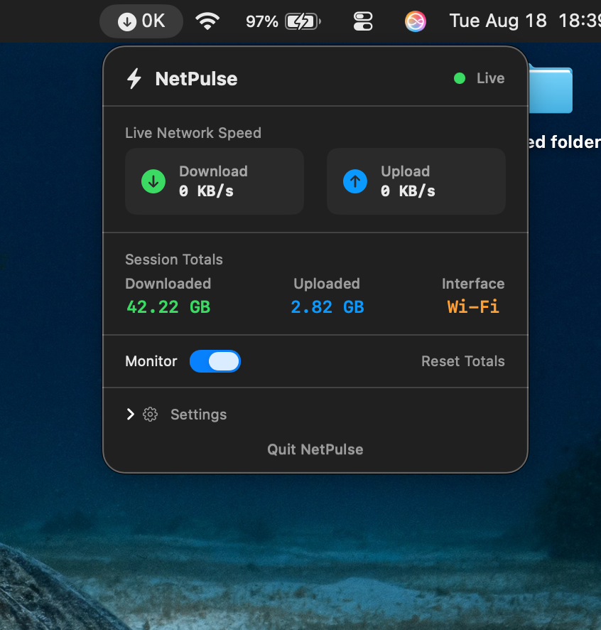
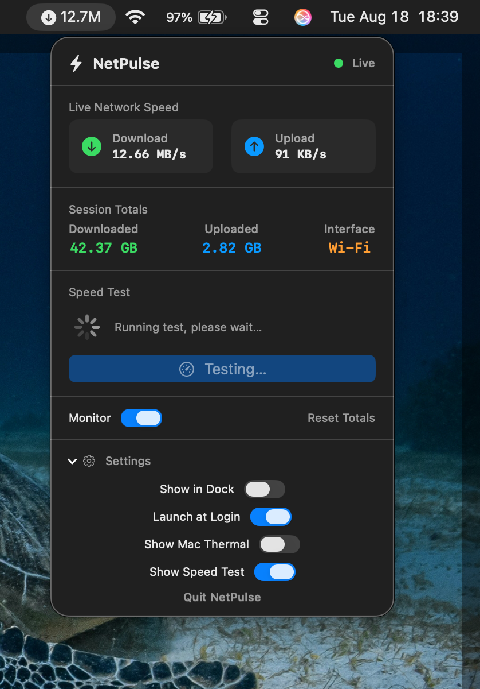

<div align="center">

# ⚡ NetPulse

**A lightweight, native macOS menu-bar app that shows your real-time network speed.**

No fake numbers. No bloat. No data drain.

[](#requirements)
[](#option-2-build-from-source)
[](LICENSE)
[](https://github.com/bwnbits)

*by [**bwnbits**](https://github.com/bwnbits)*

</div>

---

## ✨ Features

| | |
|---|---|
| 📊 | **Live speed** in the menu bar — download & upload, updated every second |
| 📈 | **Session totals** — cumulative data used, persisted across restarts |
| 🌐 | **Interface detection** — automatically detects Wi-Fi, Ethernet, VPN, and other active interfaces |
| 🌡️ | **Thermal monitoring** — keep an eye on your Mac's thermal state alongside network activity |
| 🚀 | **Built-in speed test** — real download/upload/ping test using parallel streams |
| 🕶️ | **Menu-bar only mode** — hide the Dock icon entirely, live purely in your menu bar |
| 🔓 | **Launch at Login** — starts automatically, no manual relaunching |
| 🪶 | **Minimal footprint** — reads system network stats directly via `getifaddrs`, no polling hacks, no randomized data |

---

## 📸 Screenshots

<div align="center">
<!-- Replace these with your actual screenshot files, e.g. assets/menu-bar.png -->


</div>

> 💡 Drop your screenshots into an `assets/` folder in the repo and update the paths above — GitHub's "uploading" links don't render once the upload session ends.

---

## 📦 Installation

### Option 1 — Download the DMG *(recommended)*

1. Grab the latest `.dmg` from the [**Releases page**](../../releases)
2. Open it and drag **NetPulse** into your **Applications** folder
3. Launch NetPulse from Applications
   - *First launch:* if Gatekeeper blocks it, right-click → **Open** (until full notarization is live)

### Option 2 — Build from source

```bash
git clone https://github.com/bwnbits/netpulse.git
cd netpulse
open NetPulse.xcodeproj
```

Build and run in Xcode (`⌘R`).

**Requirements:** macOS 13+ · Xcode 15+

---

## 🕹️ Usage

- Click the menu bar icon to see live speed, session totals, and run a speed test
- Toggle **Monitor** to pause/resume tracking
- Toggle **Show in Dock** if you'd rather have a normal Dock-based app
- **Reset Totals** clears your cumulative session data

---

## 🔒 Privacy

NetPulse reads network interface byte counters directly from macOS (`getifaddrs`). It does **not**:

- Inspect your traffic or browsing history
- Send any data anywhere

The only exception is an explicit, user-initiated **speed test**, which contacts public speed-test endpoints solely to measure throughput.

---

## 💻 Requirements

- macOS 13.0 or later
- Apple Silicon or Intel

---

## 🤝 Contributing

Issues and pull requests are welcome! For larger changes, please open an issue first so we can discuss the approach.

---

## 📄 License

MIT License — see [LICENSE](LICENSE) for details.

---

<div align="center">

Made with ❤️ in India by [**bwnbits**](https://github.com/bwnbits)

</div>
